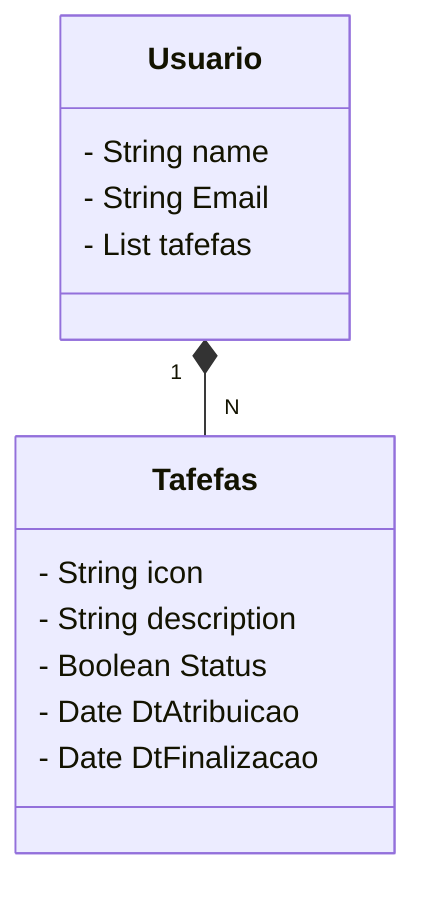

# Desafio final Santander Dev week 2023.


Idéia: Criar uma RESTful Api Java com Spring Boot, para exercitar os conceitos adquiridos durante as aulas. 
Observação: Escolher um domínio qualquer.

# Ferramentas utilizadas.

- [Spring Initializr](https://start.spring.io/)
- Spring Boot versão 3.1.4
- Java 17
- Packaging: jar
- Maven dependencies --> Spring Data JPA, Spring Web, PostgreSQL Driver, H2 Database e springdoc-openapi-starter-webmvc-ui.
- 
- ssh.exe
- git e GitHub

 


## Diagrama de Classes

# RESTFul Api Gerênciador de Tarefas.



Um usuário tem uma lista de tarefas, para gerênciar seus projetos ou qualquer tipo de tarefas.

Body JSON para testes:

# Rotas Em ambiente dev

[Swagger-ui/index.html](http://localhost:8080/swagger-ui/index.html)

# Rotas das tarefas

[GET ALL TAREFAS](http://localhost:8080/tarefas)
[GET-TAREFAS-BY-ID](http://localhost:8080/tarefas/1) 
[POST](http://localhost:8080/tarefas) --> Passar o body

# Body

```

    {
        "id": 1,
        "descricao": "Criar diagramas",
        "status": true,
        "dtAtribuicao": "2023-10-21T04:13:36.217Z",
        "dtFinalizacao": "2023-10-21T04:13:36.217Z"
        },
        {
        "id": 1,
        "descricao": "Criar diagramas",
        "status": true,
        "dtAtribuicao": "2023-10-21T04:13:36.217Z",
        "dtFinalizacao": "2023-10-21T04:13:36.217Z"
    }

```

# Rotas do usuário

[GET ALL TAREFAS](http://localhost:8080/usuarios)
[GET-TAREFAS-BY-ID](http://localhost:8080/usuarios/1) 
[POST](http://localhost:8080/usuarios) --> Passar o body


# Body
```
{
  "id": 1,
  "nome": "stringwww",
  "email": "string",
  "tarefas": [
    {
      "id": 1,
      "descricao": "stringww",
      "status": true,
      "dtAtribuicao": "2023-10-21T04:21:05.083Z",
      "dtFinalizacao": "2023-10-21T04:21:05.083Z"
    }
  ]
}

```


```

    [
  {
    "id": 1,
    "descricao": "string",
    "status": true,
    "dtAtribuicao": "2023-10-21T04:05:06.868+00:00",
    "dtFinalizacao": "2023-10-21T04:05:06.868+00:00"
  },
  {
    "id": 2,
    "descricao": "string11",
    "status": true,
    "dtAtribuicao": "2023-10-21T04:05:06.868+00:00",
    "dtFinalizacao": "2023-10-21T04:05:06.868+00:00"
  }
]
```